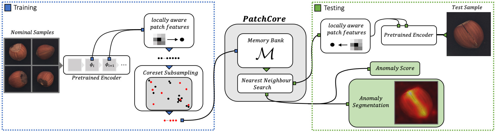
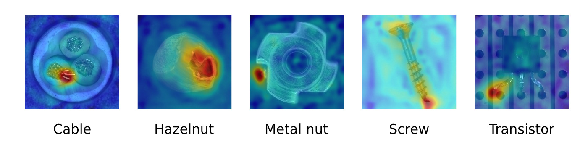
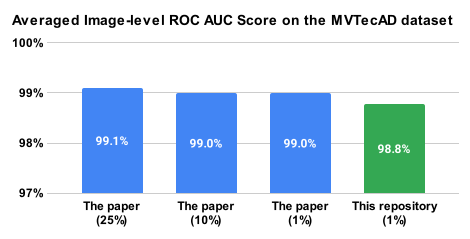
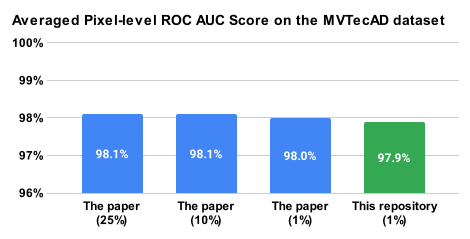
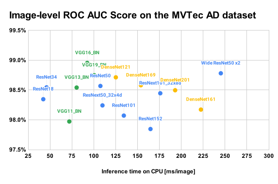
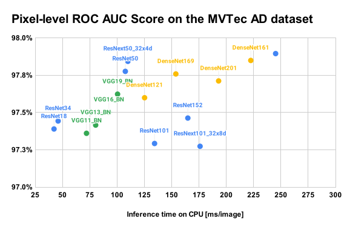
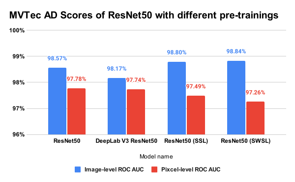

PatchCore Anomaly Detection
================================================================================

This repository provides an unofficial PyTorch implementation
of the PatchCore anomaly detection model [1] and several additional experiments.

PatchCore is an anomaly detection algorithm that has the following features:

* uses a memory-bank of nominal features extracted from a pre-trained
  backbone network (like SPADE and PaDiM), where the memory back is
  coreset-subsampled to ensure low inference cost at higher performance,
* uses an approximated nearest neighbor search for evaluating pixel-wise
  anomaly score on inference,
* shows state-of-the-art performance on the MVTec AD dataset (as of Jun 2021).

<div align="center">
    
    
</div>


Usage
--------------------------------------------------------------------------------

### Installation

The author recommends using Docker for keeping your environment clean.
For example, you can create a new Docker container and enter into it
by the following command in the root directory of this repository:

```console
docker run --rm -it -v `pwd`:/workspace -w /workspace --name patchcore tiskw/patchcore:cpu-2022-01-29
```

See [this document](SETUP.md) for more details.

### Dataset

You need to get the MVTec AD dataset [2] if you will reproduce [our experiments](experiments/README.md).
If you don't have a plan to use the dataset, you can skip this subsection.
You can download the MVTec AD dataset from
[the official website](https://www.mvtec.com/company/research/datasets/mvtec-ad)
(or [direct link to the data file](https://www.mydrive.ch/shares/38536/3830184030e49fe74747669442f0f282/download/420938113-1629952094/mvtec_anomaly_detection.tar.xz))
and put it under `data/mvtec_ad/` directory.

At first, please move to the `data/mvtec_ad/` directory.

```console
cd data/mvtec_ad/
```

Then, run the following command to download the MVTec AD dataset:

```console
wget "https://www.mydrive.ch/shares/38536/3830184030e49fe74747669442f0f282/download/420938113-1629952094/mvtec_anomaly_detection.tar.xz"
```

Finally, extract the downloaded data:

```console
tar fJx mvtec_anomaly_detection.tar.xz
```

See [this document](SETUP.md) for more details.


### Train and predict on your dataset

You can train and run predictions on your dataset using `main.py`.
In the following, we assume:

- your training images (good images) are stored under `data_train/` directory,
- your test images (good or failure images) are stored under `data_test/` directory,
- the training result will be stored at `./index.faiss`,
- the test results will be dumped under `output_test/` directory.

You can train your model by the following command:

```console
python3 main.py train -i data_train -o ./index.faiss
```

Then, you can predict anomaly score for test images by the following command:

```console
python3 main.py predict -i data_test -o output_test
```

On the output directory `output_test/`, two types of files will be dumped:
- `.jpg`: anomaly heatmap overlayed on the input image,
- `.npy`: matrix of anomaly heatmap with shape `(height, width)`.

### Replicate the experiments

If you want to replicate [the experiments](experiments/README.md),
run the following command at the root directory of this repository:

```console
python3 main_mvtecad.py runall
python3 main_mvtecad.py summarize
```

The `python3 main_mvtecad.py runall` command will take a quite long time,
therefore it is a good idea to wrap the above command by `nohup`.


Experiments
--------------------------------------------------------------------------------

### Experiment 1: Comparison with the original paper on MVTec AD dataset

The following figures are summaries of the comparison of the anomaly detection
scores on MVTec AD dataset [2] with the original paper of the PatchCore [1].
The performance of our implementation is quite close to the paper's score,
therefore our implementation may have no serious issue.

<div align="center">
    
    
</div>

See [this document](experiments/summary_comparison_with_the_paper.md)
for more details.

### Experiment 2: Comparison of backbone networks

We compared the image/pixel-level scores on the MVTec AD dataset with
different backbone networks. Some networks show a better speed/performance
tradeoff than Wide ResNet50 x2 which is used as a default backbone network
in the original paper.

<div align="center">
    
    
</div>

See [this document](experiments/summary_comparison_with_backbones.md)
for more details.

### Experiment 3: Comparison of pre-trainings

We compared several different pre-trained ResNet50 as a backbone of PatchCore.
We hypothesize that a well-trained neural network achieves higher performance.
We tried the normal ImageNet pre-training ResNet50, DeepLabV3 resNet50 pre-trained
with COCO, and ResNet50-SSL/SWSL model that are pre-trained on ImageNet [3]
with semi-supervise or un-supervised manner. The result is quite interesting,
however, basically, we can say that the normal ImageNet pre-trained model is enough
good for PatchCore purposes.

<div align="center">
    
</div>

See [this document](experiments/summary_comparison_pretraining.md)
for more details.

<!--
### Experiment 4: Approcimated k-NN vs One-class SVM

PatchCore uses k-nearest neighbor algorithm [4] in the anomaly score
computation part. However, it is commonly know that k-nearest neighbor
algotithm is sensitive for outlier data points. What happen if we use
the other types of anomaly detection algorithm as a backend of anomaly
score computation part, like one-class SVM [5]?
Does it contribute to the scores?
-->

Notes
--------------------------------------------------------------------------------
 
* This implementation refers to another PatchCore implementation [6] which
  is released under Apache 2.0 license. The author has learned a lot
  from the implementation.


References
--------------------------------------------------------------------------------

[1] K. Roth, L. Pemula, J. Zepeda, B. Scholkopf, T. Brox, and P. Gehler,
    "Towards Total Recall in Industrial Anomaly Detection",
    arXiv, 2021.
    [PDF](https://arxiv.org/pdf/2106.08265.pdf)

[2] P. Bergmann M. Fauser D. Sattlegger, and C. Steger,
    "MVTec AD - A Comprehensive Real-World Dataset for Unsupervised Anomaly Detection",
    CVPR, 2019.
    [PDF](https://openaccess.thecvf.com/content_CVPR_2019/papers/Bergmann_MVTec_AD_--_A_Comprehensive_Real-World_Dataset_for_Unsupervised_Anomaly_CVPR_2019_paper.pdf)

[3] I. Yalniz, H. Jegou, K. Chen, M. Paluri and D. Mahajan,
    "Billion-scale semi-supervised learning for image classification",
    arXiv, 2019.
    [PDF](https://arxiv.org/pdf/1905.00546.pdf)

[4] E. Fix and J. Hodges,
    ”Discriminatory Analysis. Nonparametric Discrimination: Consistency Properties”,
    USAF School of Aviation Medicine, Randolph Field, Texas, 1951.

[5] B. Scholkopf, R. Williamson, A. Smola, J. Shawe-Taylor and J. Platt,
    "Support Vector Method for Novelty Detection",
    NIPS, 1999.
    [PDF](https://proceedings.neurips.cc/paper/1999/file/8725fb777f25776ffa9076e44fcfd776-Paper.pdf)

[6] [hcw-00/PatchCore_anomaly_detection](https://github.com/hcw-00/PatchCore_anomaly_detection), GitHub.
