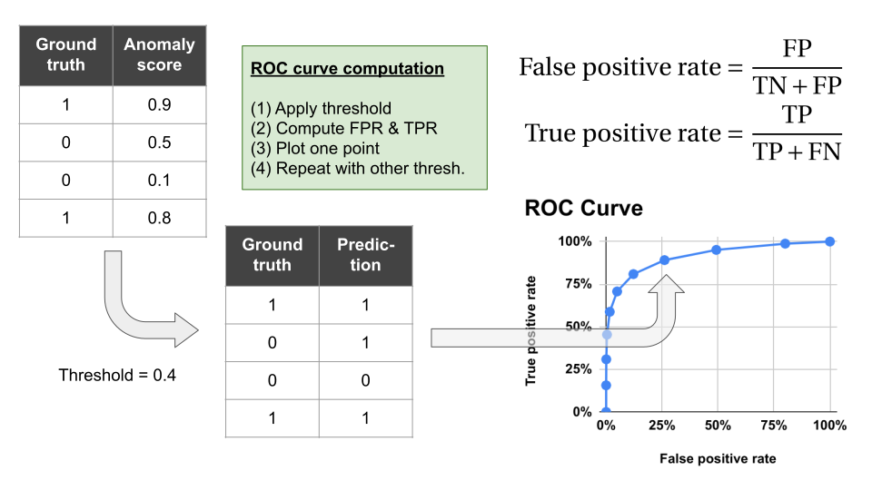

Scores used in the MVTec AD dataset
================================================================================

Image-level ROC AUC score
--------------------------------------------------------------------------------

The Iimage-level ROC AUC score is a metric for image-wise anomaly detection
performance. This score is not mentioned in the MVTec AD dataset paper,
however, from an application point of view, it is quite important to measure
the image-wise performance of anomaly detection algorithms, therefore,
this score is commonly used in the image anomlay detection paper,
like SPADE and PaDiM.

Definition of the image-level ROC AUC score is quite simple.
Let's assume that the target anomaly detection algorithm can compute anomaly
values for each image. The image-level ROC AUC acore is defined as
AUC (Area Under the Curve) of ROC (Receiver Operatorating Characteristic)
curve of the anomaly values computed per image by the target algorithm.

### What's ROC curve?

Assume that the target model outputs anomaly score (real value) for each
samples that have ground truth label (for example, 0: good, 1: anomaly).
ROC curve is a plotting of TPR (True Positive Rate) versus
FPR (False Positive Rate) with all threshold for anomaly score.

    

### What's AUC?

AUC is a normalied area under the ROC curve.
The minimum and maximum AUC score is 0 and 1 respectively.

### Pros and Cons

* Quite intuitive for many applications
* Insensitive for anomaly location.

Pixel-level ROC AUC score
--------------------------------------------------------------------------------

Score computation is almost the same as the image-level ROC AUC score,
but the base table is not image-level table, but pixel level table.

| Sample                      | Anomaly score |
|:---------------------------:|:-------------:|
| pixel (0, 0) of the image 0 | a(0, 0, 0)    |
| pixel (1, 0) of the image 0 | a(1, 0, 0)    |
| ...                         | ...           |

### Pros and Cons

* Sensitive for anomaly location
* Not intuitive for some applications
