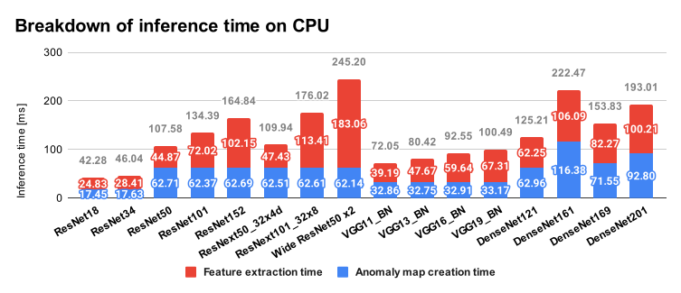

Comparison of backbone networks
================================================================================

This directory contains experiment results of different backbones
on MVTec AD dataset.

Purpose
--------------------------------------------------------------------------------

It's quite easy to swap the backborn network in the PatchCore algorithm
(default: Wide ResNet50 x2). It's meaningful to find a good backbone network
which shows a good performance-speed tradeoff from an application view point.

What we've done
--------------------------------------------------------------------------------

Try several backbone networks and evaluate their average
image/pixel-level scores in the MVTecAD dataset.

### Test Environment

- CPU: Intel(R) Xeon(R) CPU E5-2690 v4 @ 2.60GHz (56 cores)
- RAM: 128 GB

Conclution
--------------------------------------------------------------------------------

The smaller ResNet (ResNet18, ResNet34) shows enough good
scores even for their small computational cost. On the otherhand, very deep
ResNet (ResNet101, ResNet152) shows a lower performance than ResNet50.
Current tentative hypothesis is that the features used in the PatchCore
algorithm are too deep (too far from input) and don't have enough
high-resolution (raw) input information in them. In other words, we should
add more shallower fatures in the case of very deep neural networks
like ResNet101 and ResNet152 for exceeding ResNet50's score.

    
    
    

