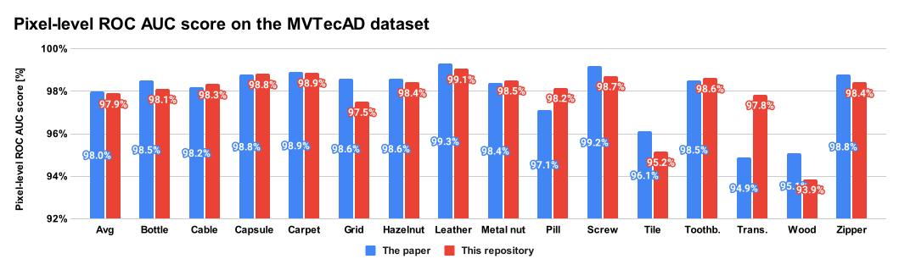

Comparison with the original paper
================================================================================

We reproduced the same experiments with the original paper,
image-level and pixel-level ROC AUC score on the MVTec AD dataset
(see the table S1 and S2 on page 15 of the paper),
for checking that our code correctly implemented the PatchCore algorithm.

Conclusion
--------------------------------------------------------------------------------

The average image-level and pixel-level ROC AUC scores of our code are quite
close to the paper's score if the sampling ratio is 1%, therefore the author
thinks our code may not have a serious issue.

|           | Sampling ratio | Average image-level roc auc score | Average pixel-level roc auc score |
|:---------:|:--------------:|:---------------------------------:|:---------------------------------:|
| The paper | 1.0 %          | 99.0 %                            | 98.0 %                            |
| This repo | 1.0 %          | 98.8 %                            | 97.9 %                            |

Results
--------------------------------------------------------------------------------

    
    

